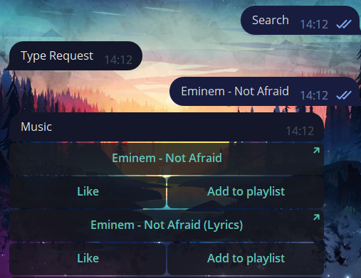

# MyBot
   

[**MyBot**](https://t.me/YouApiMusicBot) - a handy bot for finding music on YouTube

[**MyApi**](https://github.com/AntonKharchuk/MyApi) - provides the ability to retrieve feeds related to videos, users, and playlists

*p.s. you should run both to start a bot*

## Description

## Examples

:mag: **Search**

:microphone: **Artist**

:star: **Trend**

:violin: **Genres**

:heart: **Likes**

:headphones: **Playlist**

:heavy_plus_sign: **Add to playlist**

:link:**Bot link**

https://t.me/YouApiMusicBot
